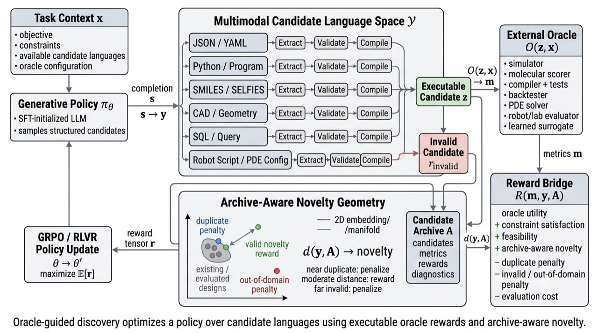

# Oracle-Guided Discovery



Scientific design is not a chatbot problem. A useful discovery system must emit an object that can be parsed, validated, executed, measured, rejected, archived, and improved. The central object in this repository is therefore not a prompt. It is a closed loop:

```text
structured candidate space
  -> supervised policy initialization
  -> group-relative reinforcement fine-tuning
  -> external oracle evaluation
  -> reward tensor construction
  -> policy improvement
  -> novel candidate generation
```

The motivating claim is simple: language models are valuable in scientific discovery when they become policies over structured candidate languages, not when they summarize domain knowledge. A candidate may be a molecule string, a Python program, a CAD parameter file, a YAML simulation input, a SQL query, a robot action script, a PDE boundary-condition specification, or a materials recipe. The common structure is identical across domains: the model proposes a candidate, a domain interface extracts and validates it, an oracle evaluates it, and reinforcement learning shifts the generator toward candidates that score higher under explicit scientific criteria.

## Core thesis

Oracle-guided discovery separates generation from evaluation. The language model supplies a flexible prior over candidate representations. The oracle supplies domain-specific measurement. The reward bridge converts executable measurements, validity checks, uncertainty penalties, cost penalties, and archive-relative novelty into scalar rewards for policy optimization.

This separation matters because scientific evaluators are heterogeneous. A single project may use an XGBoost surrogate, a physics simulator, a molecular docking engine, a finite-element solver, a PDE solver, a compiler, a financial backtester, or a laboratory robot. The generator should not encode those evaluators as prose. It should learn to produce candidates that survive them.

## What makes the loop rigorous

The method treats every sampled completion as part of the evidence trail. Invalid outputs are not discarded. Parse failures, schema failures, compilation failures, oracle failures, duplicates, out-of-domain candidates, and high-uncertainty candidates remain visible in the archive and in the reported metrics. This prevents the standard failure mode where a system reports only the small subset of generations that happen to execute.

The archive is part of the objective. Novelty is measured against previously evaluated candidates, but novelty is bounded: duplicates are penalized, controlled movement away from the archive is rewarded, and extreme out-of-domain drift is penalized. Discovery is therefore framed as movement along an executable design manifold, not as unbounded distance from training data.

The oracle is also treated as an estimand, not as truth. A learned surrogate, simulator, verifier, or laboratory assay defines what is being optimized. When the oracle is cheap and imperfect, uncertainty and calibration become first-class components of the reward. Expensive evaluators are reserved for top-ranked or diverse candidates after the low-cost policy-improvement loop.

## Method shape

The policy first learns candidate syntax and domain regularities by supervised fine-tuning. Reinforcement fine-tuning then samples groups of completions for the same task context. Each completion is passed through extraction, validation, compilation, oracle execution, reward construction, and archive update. Group-relative advantages convert the oracle-derived rewards into policy-gradient updates.

The reward is a convex scalarization over the quantities the discovery system must preserve:

```text
oracle utility
candidate validity
compilation and execution success
constraint satisfaction
calibrated uncertainty
evaluation cost
archive-relative novelty
```

High-reward candidates are not merely high-scoring under the oracle. They are candidates that jointly preserve utility, validity, feasibility, and non-duplicative novelty under a fixed query budget.

## Research direction

The long-term target is **Property-Conditioned Hierarchical Attention for Scientific Inverse Design**. The current foundation is the oracle-guided loop: a general training and evaluation structure for turning scientific benchmarks into policy-optimization environments. Attention variants, PEFT variants, full fine-tuning, LoRA, QLoRA, DoRA, prefix tuning, prompt tuning, GRPO-style objectives, and alternative weight-update rules become ablations inside the same discovery protocol.

The key research question is not whether an LLM can imitate known examples. The key question is whether an oracle-guided policy can increase the probability of valid, executable, high-utility, archive-novel candidates under fixed compute and oracle budgets.

## Evaluation philosophy

A credible discovery system reports rates, not anecdotes. The primary quantities are parse rate, validation rate, compilation rate, executable-candidate rate, oracle reward over all sampled candidates, reward over executable candidates, duplicate rate, out-of-domain rate, archive-distance distribution, uncertainty distribution, cost per evaluated candidate, and top-candidate validation under a stronger external evaluator.

The strongest result is not a single impressive generation. The strongest result is a reproducible shift in the candidate distribution: after oracle-guided policy optimization, more probability mass should land on candidates that are valid, executable, high-scoring, and meaningfully novel.

## Why this repository exists

This repository is a scaffold for a general oracle-guided scientific discovery platform. Perovskites, trading strategies, molecules, PDE configurations, CAD designs, and robot action programs are instances of the same abstraction. The scientific content lives in the oracle and candidate-language interface. The machine-learning contribution lives in the policy-improvement mechanism that learns from executable evaluator feedback rather than prompt-level preference text.

The project is intentionally framed around the full discovery loop: structured generation, verifier-style reward construction, archive-aware novelty, uncertainty-aware oracle scoring, and reinforcement fine-tuning. That loop is the unit of rigor.
